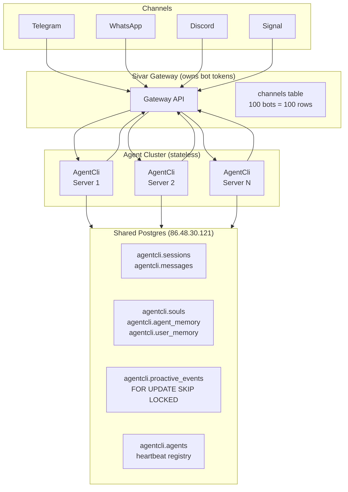
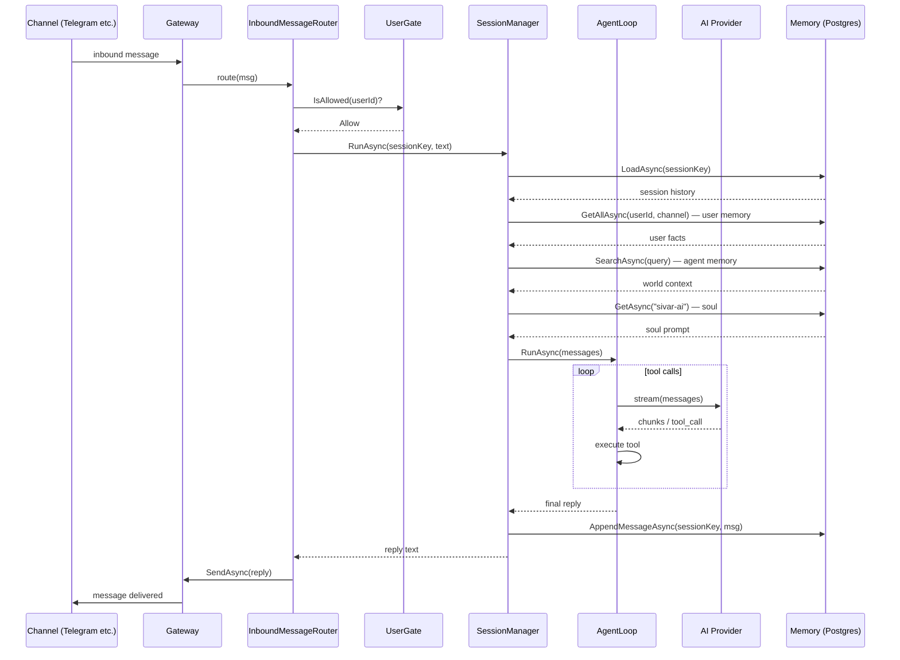
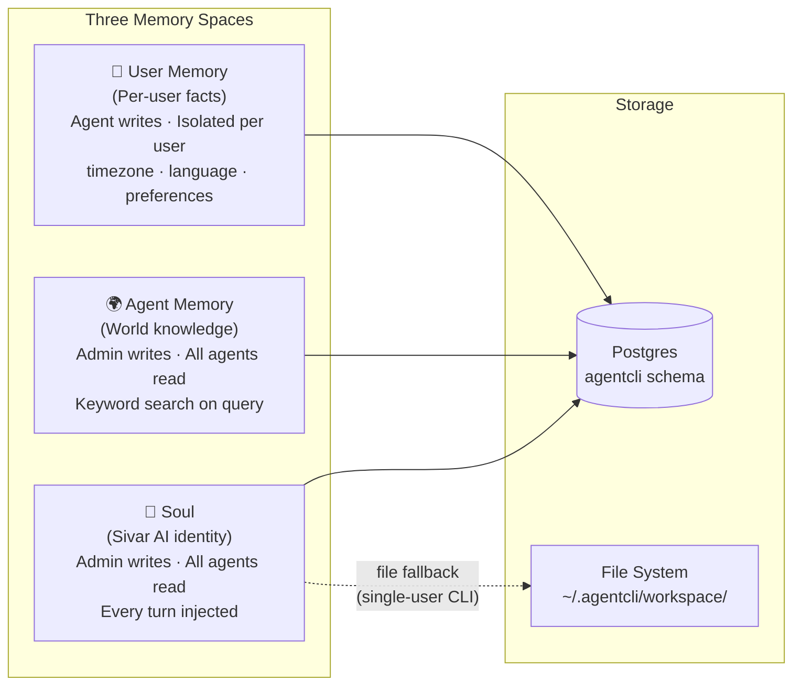
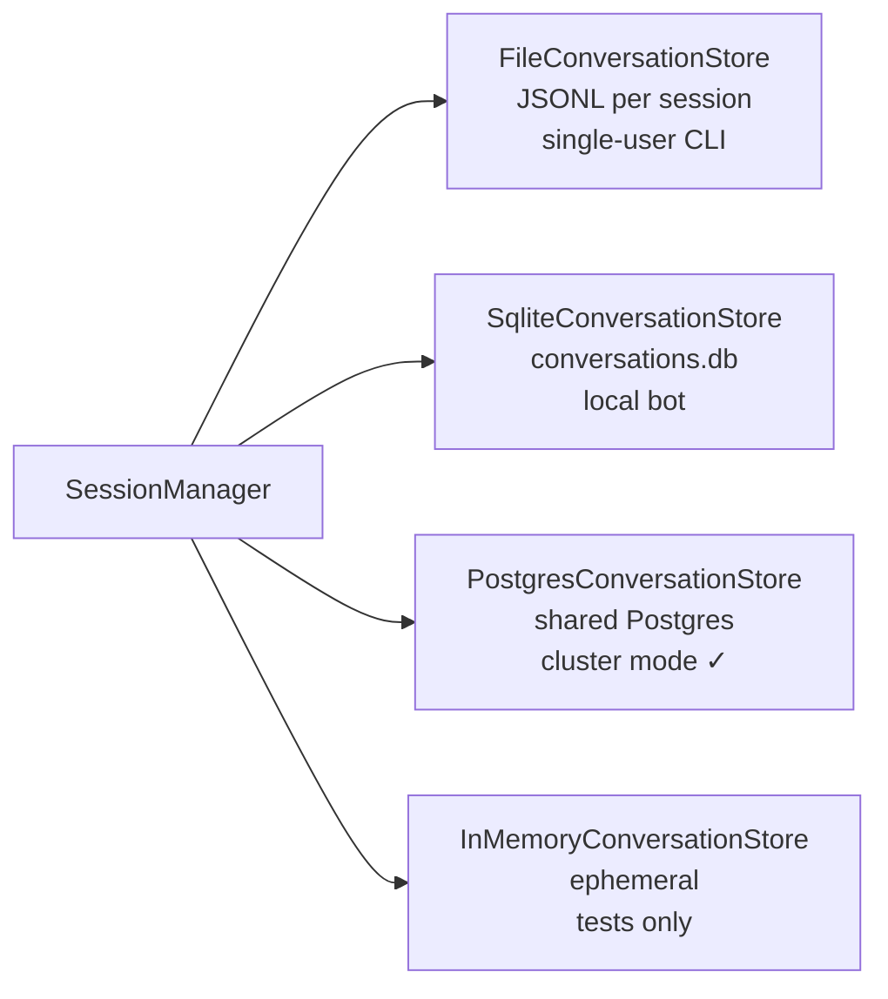
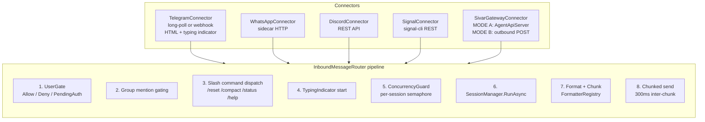
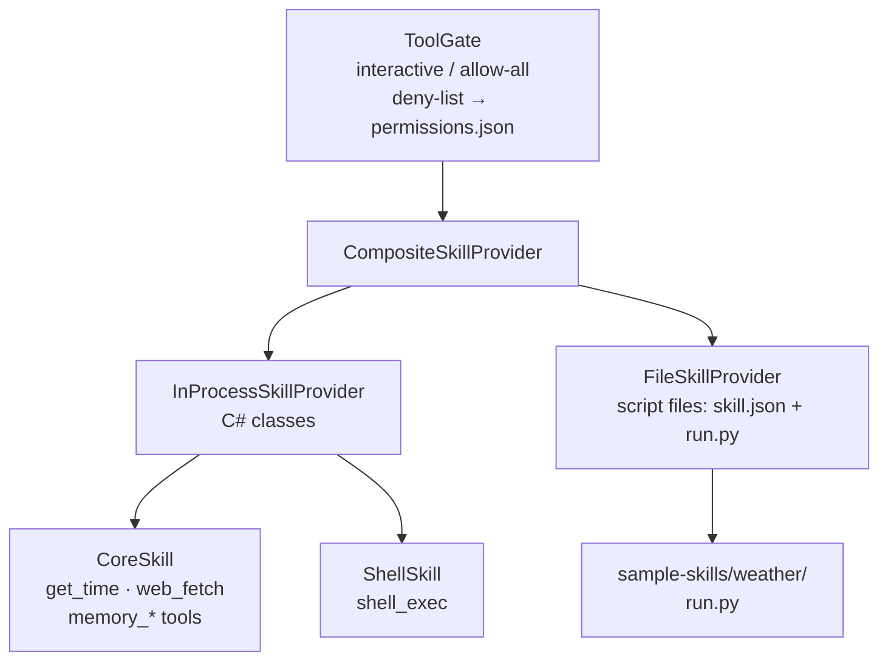
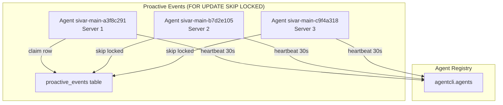

# AgentCli

A production-grade C# AI agent framework — multi-provider, multi-channel, multi-server.  
Ships as a console app today; designed to run as a cluster of stateless agents tomorrow.

> **Status:** All subsystems built and tested. 56/56 tests passing.

---

## Table of Contents

- [Overview](#overview)
- [Architecture](#architecture)
- [Quick Start](#quick-start)
- [AI Providers](#ai-providers)
- [Memory System](#memory-system)
- [Session Persistence](#session-persistence)
- [Channel Connectors](#channel-connectors)
- [Skills & Tools](#skills--tools)
- [Output Formatting](#output-formatting)
- [Cluster Mode](#cluster-mode)
- [Configuration Reference](#configuration-reference)
- [REPL Commands](#repl-commands)
- [Adding Providers / Tools / Skills](#extending)

---

## Overview

AgentCli is an agentic loop framework built in C#/.NET 9. It handles everything between "user sends a message" and "agent sends a reply":

```
User → [Channel] → [Router] → [SessionManager] → [AgentLoop] → [AI Provider]
                                                       ↕
                                              [Tools / Skills]
                                                       ↕
                                            [Memory / Soul / World]
```

Key design principles:
- **Minimum code** — every layer is an interface; swap any piece without touching the rest
- **Stateless agents** — all state lives in Postgres; any agent on any server handles any user
- **Ship-oriented** — works as a single-user CLI today, scales to a bot cluster without rewriting

---

## Architecture

### High-Level System



> Agents have **no bot tokens**. They read from Postgres, run an AI turn, and POST the reply back to the Gateway. The Gateway owns all channel credentials.

---

### Agent Turn Pipeline



---

### Folder Structure

```
AgentCli/
├── App.cs                      # Full lifecycle: init → REPL → shutdown
├── Program.cs                  # 2-line entry point
│
├── AI/
│   ├── IAiProvider.cs          # Provider interface (StreamAsync)
│   ├── AgentLoop.cs            # Tool-call loop, SSE streaming, history management
│   ├── OpenAiCompatibleProvider.cs  # Base for all OpenAI-compatible endpoints
│   ├── AiProviders.cs          # OpenAI, Groq, Mistral, xAI, OpenRouter, Together, Ollama
│   ├── GitHubCopilotProvider.cs     # Device auth + Copilot token exchange
│   ├── AnthropicProvider.cs    # Native Messages API → OpenAI SSE adapter
│   ├── AzureOpenAiProvider.cs
│   ├── ProviderRegistry.cs     # Build() factory; merges CLI > file > env
│   └── ProviderConfig.cs       # Load/save ~/.agentcli/providers.json
│
├── Memory/
│   ├── IMemoryProvider.cs      # File-based memory interface (Read/Write/Append/List/Search)
│   ├── FileMemoryProvider.cs   # Maps keys → ~/.agentcli/workspace/ files
│   ├── MemorySystem.cs         # Coordinator: soul injection, daily notes, workflow reads
│   ├── MemoryTypes.cs          # Shared records: ChatMessage, ToolCall, ToolDefinition…
│   ├── IAgentMemory.cs         # ISoulProvider + IAgentMemory + IUserMemory interfaces
│   └── PostgresMemoryProviders.cs  # Postgres-backed: Soul (cached), AgentMemory, UserMemory
│
├── Sessions/
│   ├── IConversationStore.cs   # Store interface: Load/Save/Append/Delete/List/Exists
│   ├── FileConversationStore.cs     # JSONL per session (single-user CLI)
│   ├── SqliteConversationStore.cs   # Single DB file (local bot)
│   ├── InMemoryConversationStore.cs # Ephemeral (tests only)
│   ├── PostgresConversationStore.cs # Shared Postgres (cluster mode) ← includes EnsureSchemaAsync
│   └── SessionManager.cs       # Smart layer: load → inject soul/memory → run → persist → compact
│
├── Channels/
│   ├── IChannelConnector.cs    # IChannelConnector, ITypingIndicator, IUserGate, ConcurrencyGuard
│   ├── InboundMessageRouter.cs # Full pipeline: gate → group-gating → commands → turn → send
│   ├── TelegramConnector.cs    # Long-poll + webhook, HTML, typing indicator
│   ├── WhatsAppConnector.cs    # Sidecar HTTP send, webhook receive
│   ├── DiscordConnector.cs     # REST API, 2000-char chunks
│   ├── SignalConnector.cs      # signal-cli REST
│   ├── SivarGatewayConnector.cs # Bridge to Sivar.Os.Gateway (MODE A: AgentApiServer / MODE B: outbound POST)
│   └── DeliveryQueue.cs        # File-backed retry: immediate → queue → exp backoff → failed/
│
├── Skills/
│   ├── ISkillProvider.cs       # ISkill + ISkillProvider interface
│   ├── SkillProviders.cs       # InProcessSkillProvider, FileSkillProvider, CompositeSkillProvider
│   ├── SkillTypes.cs           # SkillDefinition, SkillParameter records
│   ├── ToolGate.cs             # IToolGate: interactive / allow-all / deny-list; persists to permissions.json
│   └── Builtin/
│       ├── CoreSkill.cs        # get_time, web_fetch, memory_* tools
│       └── ShellSkill.cs       # shell_exec tool (gated by IToolGate)
│
├── Formatting/
│   ├── IOutputFormatter.cs     # Format(text) → FormattedMessage; Chunk(text) → string[]
│   ├── MarkdownProcessor.cs    # markdown → IR (StyleSpan, LinkSpan) → channel-specific output
│   ├── Formatters.cs           # 9 channel formatters (see table below)
│   └── FormatterRegistry.cs    # Keyed registry; unknown channel → plain fallback
│
└── Cluster/
    ├── ProactiveScheduler.cs   # Poll proactive_events every 10s, FOR UPDATE SKIP LOCKED
    └── AgentRegistry.cs        # Startup upsert + 30s heartbeat; DrainAsync for graceful shutdown

AgentCli.Tests/
├── FormatterTests.cs           # 24 unit tests — all channel formatters
├── ConversationStoreTests.cs   # 18 tests — File, SQLite, InMemory, AgentId, ClusterOptions
├── PostgresStoreIntegrationTests.cs  # 5 tests — real Postgres (skips without env var)
└── MemoryIntegrationTests.cs   # 13 tests — Soul, AgentMemory, UserMemory (skips without env var)
```

---

## Quick Start

### Prerequisites

- [.NET 9 SDK](https://dotnet.microsoft.com/download)
- A GitHub account with [GitHub Copilot](https://github.com/features/copilot) *(or any other provider key)*

### Run

```bash
git clone https://github.com/egarim/AgentCli
cd AgentCli
dotnet run --project AgentCli
```

On first run you'll be prompted to authorize GitHub Copilot via device flow — open a URL, enter a code. Token is cached and reused. Everything else auto-creates on first run: workspace, SOUL.md, MEMORY.md, WORKFLOW_AUTO.md.

---

## AI Providers

10 providers, all streaming, all tool-call capable:

| ID | Service | Default model | Auth |
|---|---|---|---|
| `github-copilot` | GitHub Copilot *(default)* | claude-sonnet-4.5 | Device flow → cached token |
| `openai` | OpenAI | gpt-4o | `OPENAI_API_KEY` |
| `azure-openai` | Azure OpenAI | *(your deployment)* | `AZURE_OPENAI_API_KEY` + endpoint + deployment |
| `anthropic` | Anthropic Claude | claude-sonnet-4-5 | `ANTHROPIC_API_KEY` |
| `groq` | Groq | llama-3.3-70b-versatile | `GROQ_API_KEY` |
| `mistral` | Mistral AI | mistral-large-latest | `MISTRAL_API_KEY` |
| `xai` | xAI (Grok) | grok-3-fast | `XAI_API_KEY` |
| `openrouter` | OpenRouter | openrouter/auto | `OPENROUTER_API_KEY` |
| `together` | Together AI | Llama-3.3-70B | `TOGETHER_API_KEY` |
| `ollama` | Ollama *(local)* | llama3.2 | None — always available |

All OpenAI-compatible providers share `OpenAiCompatibleProvider` base. Anthropic uses a native Messages API adapter that converts to OpenAI SSE chunks — `AgentLoop` is provider-agnostic.

---

## Memory System



### Access Rules

| Space | Written by | Read by | Isolation |
|---|---|---|---|
| **Soul** | Admin only (direct DB) | All agents, every turn | None — single `sivar-ai` row |
| **Agent Memory** | Admin only (world knowledge) | All agents, all users | None — shared global facts |
| **User Memory** | Agent during conversation | Agent only, for that user | Hard — `(user_id, channel)` in every query |

### File-Based Memory (single-user CLI)

Stored in `~/.agentcli/workspace/`:

| File | Purpose |
|---|---|
| `SOUL.md` | Agent personality — injected into every system prompt |
| `MEMORY.md` | Long-term curated memory — agent writes via `memory_write` tool |
| `memory/YYYY-MM-DD.md` | Daily notes — agent appends via `daily_note` tool |
| `WORKFLOW_AUTO.md` | Files auto-loaded on every startup |

### Postgres Memory (cluster mode)

```sql
agentcli.souls        -- agent_type PK, name, prompt, version (60s cache + hot reload)
agentcli.agent_memory -- key PK, content TEXT, tags TEXT[] with GIN index
agentcli.user_memory  -- (user_id, channel, key) PK — impossible to cross-contaminate
```

Soul updates propagate to all agents within 60s (version check) — no restarts needed.

`DeleteAllAsync(userId, channel)` = GDPR right-to-forget.

---

## Session Persistence



All backends implement the same `IConversationStore` interface — swap one line in config.

### Session Keys

```
telegram:direct:5932684607          ← Telegram DM
telegram:group:-1001234567890       ← Telegram group
whatsapp:direct:+15551234567        ← WhatsApp DM
discord:guild:123456789:channel:987 ← Discord channel
main                                ← single-user CLI
```

### Compaction

When a session exceeds `MaxMessages` (default: 100) or `MaxChars` (default: 80,000), `SessionManager` runs a summarization turn and replaces the history with the summary. The summary lives in the store — any agent that picks up the session next gets the full context.

---

## Channel Connectors



### Delivery Queue

Failed sends are queued to `~/.agentcli/delivery-queue/`, retried with exponential backoff (`2^n × 2s`, max 5 retries), then moved to `failed/`.

### User Gate

| Mode | Behavior |
|---|---|
| `AllowAllUserGate` | Open — every user can talk to the agent |
| `AllowlistUserGate` | Reads `~/.agentcli/allowlist.json`; unknown users get `PendingAuth` |

---

## Skills & Tools



### Built-in Tools

| Tool | Description |
|---|---|
| `get_time` | Current local date and time |
| `web_fetch` | Fetch plain text from a URL |
| `memory_write` | Save a fact to MEMORY.md |
| `memory_search` | Keyword search across all memory files |
| `memory_read_all` | Read full MEMORY.md |
| `daily_note` | Append to today's daily note |
| `shell_exec` | Run a shell command *(gated — requires approval)* |

### File-Based Skills

Drop a folder into `~/.agentcli/skills/my-skill/` with:
- `skill.json` — tool name, description, parameters
- `run` (or `run.py`, `run.sh`) — executed as `./run <toolName> '<argsJson>'`; stdout = result

Any language works.

### Tool Gate Modes

| Mode | Behavior |
|---|---|
| `interactive` | Prompts before unknown tools; "always allow" persists to `permissions.json` |
| `allow-all` | No prompting (footgun — use with trusted skills only) |
| deny-list | Tools in `permissions.json` as `denied` are always blocked |

---

## Output Formatting

All agent output goes through `FormatterRegistry` before sending. Each channel has its own formatter:

| Channel | Format | Tables | Char limit |
|---|---|---|---|
| `telegram` | HTML (`<b>`, `<i>`, `<code>`, `<pre>`) | code block | 4,096 |
| `discord` | Native markdown passthrough | code block | 2,000 |
| `whatsapp` | `**→*` `~~→~`, fences preserved | bullets | 65,536 |
| `signal` | Plain text + out-of-band `StyleRanges[]` | bullets | 64,000 |
| `slack` | mrkdwn (`*bold*`, `_italic_`, `<url\|label>`) | bullets | 40,000 |
| `googlechat` | Same as WhatsApp | bullets | ∞ |
| `webchat` | Raw markdown passthrough | — | ∞ |
| `terminal` | Passthrough | — | ∞ |
| `plain` | Strip all markdown | strip | ∞ |

Messages exceeding the channel limit are automatically chunked with 300ms between chunks.

---

## Cluster Mode



### How It Works

1. **Shared Postgres** — `agentcli.sessions` + `agentcli.messages` on a single host (`86.48.30.121`).  
   Any agent reads/writes the same session history. No ownership table needed.

2. **Agent identity** — `{name}-{machineId}` where `machineId = SHA256(hostname + MAC)[0..7]`.  
   Deterministic — same server always gets the same ID across restarts.

3. **Proactive dedup** — `FOR UPDATE SKIP LOCKED`.  
   When multiple agents poll `proactive_events`, Postgres ensures exactly one agent claims each row. No Redis. No distributed locks.

4. **Reply routing** — agents POST replies to the Gateway's outbound endpoint.  
   Agents have **no bot tokens**. Add a new channel = add a row to `channels` table = zero agent changes.

5. **Graceful drain** — `AgentRegistry.DrainAsync()` sets status to `draining` before shutdown.  
   Gateway stops routing new messages to this agent. In-flight turns complete normally.

### Postgres Schema

```sql
-- Auto-created on first startup (EnsureSchemaAsync — idempotent)

agentcli.sessions        (session_key PK, channel, user_id, chat_type, ...)
agentcli.messages        (id, session_key FK, role, content, tool_calls JSONB, position, ...)
agentcli.souls           (agent_type PK, name, prompt, version, updated_by)
agentcli.agent_memory    (key PK, content, tags TEXT[], GIN index)
agentcli.user_memory     (user_id, channel, key — composite PK, value)
agentcli.proactive_events(id UUID PK, user_id, channel, event_type, payload JSONB, status, claimed_by, ...)
agentcli.agents          (agent_id PK, agent_name, host, reply_gateway, last_heartbeat, status)
agentcli.channels        (channel_id PK, channel_type, bot_token, gateway_id, display_name)
```

### Enable Cluster Mode

Add to `appsettings.json` (or env vars):

```json
{
  "Cluster": {
    "AgentName":         "sivar-main",
    "Host":              "http://154.12.236.61:5050",
    "ReplyGateway":      "https://bot.sivar.lat",
    "ConnectionString":  "Host=86.48.30.121;Port=5432;Database=agentcli;Username=postgres;Password=..."
  }
}
```

When `ConnectionString` is set, `PostgresConversationStore` is used automatically instead of SQLite.

### Run integration tests against live Postgres

```bash
AGENTCLI_TEST_POSTGRES="Host=86.48.30.121;Port=5432;Database=agentcli_test;Username=postgres;Password=..." \
  dotnet test
```

Tests skip cleanly without the env var — CI works with no DB.

---

## Configuration Reference

Config priority (**highest wins**):

```
CLI flags  >  providers.json  >  environment variables
```

### providers.json

Located at `~/.agentcli/providers.json`:

```json
{
  "default": "github-copilot",
  "providers": {
    "openai":       { "apiKey": "sk-...",      "model": "gpt-4o-mini" },
    "anthropic":    { "apiKey": "sk-ant-..." },
    "groq":         { "apiKey": "gsk_..." },
    "azure-openai": { "apiKey": "...", "endpoint": "https://myresource.openai.azure.com", "deployment": "gpt-4o" },
    "ollama":       { "baseUrl": "http://192.168.1.100:11434", "model": "llama3.2" }
  }
}
```

### Environment Variables

| Provider | Variables |
|---|---|
| `openai` | `OPENAI_API_KEY` |
| `azure-openai` | `AZURE_OPENAI_API_KEY`, `AZURE_OPENAI_ENDPOINT`, `AZURE_OPENAI_DEPLOYMENT`, `AZURE_OPENAI_API_VERSION` |
| `anthropic` | `ANTHROPIC_API_KEY` |
| `groq` | `GROQ_API_KEY` |
| `mistral` | `MISTRAL_API_KEY` |
| `xai` | `XAI_API_KEY` |
| `openrouter` | `OPENROUTER_API_KEY` |
| `together` | `TOGETHER_API_KEY` |
| `ollama` | `OLLAMA_BASE_URL` *(optional, defaults to localhost:11434)* |

### CLI Flags

```bash
dotnet run --project AgentCli -- --provider groq --model llama-3.3-70b-versatile
dotnet run --project AgentCli -- --login    # force re-auth for GitHub Copilot
```

---

## REPL Commands

### Providers

| Command | Description |
|---|---|
| `/providers` | List all registered providers — active, default model, key status |
| `/switch <id>` | Switch provider mid-session (rebuilds agent, keeps memory) |

### Config

| Command | Description |
|---|---|
| `/config show` | Full config (API keys masked) |
| `/config set <provider> <key> <value>` | Set value, save, rebuild registry |
| `/config get <provider> <key>` | Read a config value |
| `/config unset <provider> <key>` | Remove a config value |
| `/config default <provider>` | Set the default provider |

### Memory

| Command | Description |
|---|---|
| `/memory` | Print `MEMORY.md` |
| `/soul` | Print `SOUL.md` |
| `/daily` | Print today's daily note |
| `/workflow` | Print `WORKFLOW_AUTO.md` |

### Skills

| Command | Description |
|---|---|
| `/skills` | List all registered skills and their tools |
| `/skills reload` | Hot-reload file-based skills from disk |

### Permissions

| Command | Description |
|---|---|
| `/permissions` | Show current gate mode and allow/deny lists |
| `/permissions mode interactive\|allow-all` | Switch gate mode |
| `/permissions allow <tool>` | Always allow a tool (no prompt) |
| `/permissions deny <tool>` | Always deny a tool |
| `/permissions reset` | Clear all saved permissions |

---

## Extending

### Adding a Provider

Extend `OpenAiCompatibleProvider` for OpenAI-compatible APIs:

```csharp
public class MyProvider : OpenAiCompatibleProvider
{
    public MyProvider(HttpClient http, string apiKey)
        : base(http, "my-provider", "My Service",
               "https://api.example.com/v1", "my-model-v1")
        => _apiKey = apiKey;

    protected override void SetAuthHeaders(HttpRequestMessage req) =>
        req.Headers.Add("Authorization", $"Bearer {_apiKey}");

    private readonly string _apiKey;
}
```

Register it in `ProviderRegistry.Build()`.

### Adding a Tool (C#)

```csharp
agent.RegisterTool(
    name:        "my_tool",
    description: "Does something useful",
    schema: new {
        type       = "object",
        properties = new { input = new { type = "string" } },
        required   = new[] { "input" }
    },
    handler: async args => {
        var input = args.GetProperty("input").GetString()!;
        return await DoSomethingAsync(input);
    });
```

### Adding a File-Based Skill (any language)

Create `~/.agentcli/skills/my-skill/skill.json`:

```json
{
  "name": "my_tool",
  "description": "Does something useful",
  "parameters": [
    { "name": "input", "type": "string", "description": "The input", "required": true }
  ]
}
```

Create `~/.agentcli/skills/my-skill/run.py`:

```python
#!/usr/bin/env python3
import sys, json
tool_name = sys.argv[1]
args = json.loads(sys.argv[2])
print(f"Result: {args['input']}")
```

```bash
chmod +x ~/.agentcli/skills/my-skill/run.py
```

Then `/skills reload` inside the REPL.

---

## License

MIT
